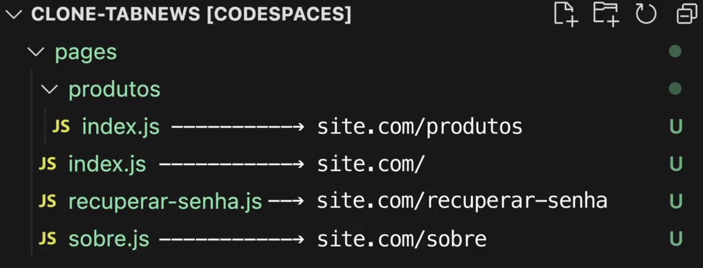

# Next.js
Framework para desenvolvimento web, entrega para a web as rotas que contem as paginas (paginas podem ser feitas com outras bibliotecas, como com o **React** que fará os componentes concretos para serem exibidos).

- Site do framework: https://nextjs.org/
- Site da empresa por trás: https://vercel.com/

## File-Base Routing
Cria paginas baseado em arquivos, a rota publica indica a pasta onde o arquivo está.

